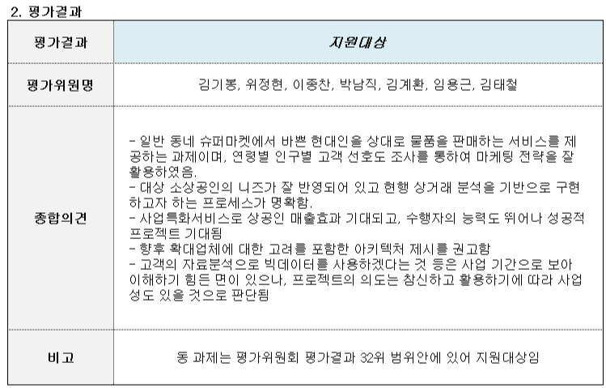
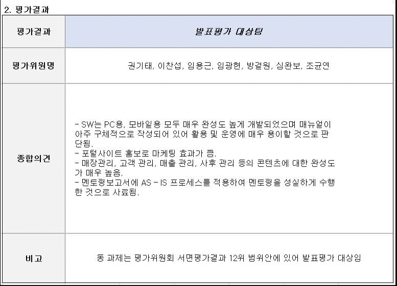

---
tags:
  - 프로젝트
  - 대학시절
  - 커머스
  - 공모전
  - 정부지원
기간: 2016.06~2016.11
상태: 완료
도메인: E-커머스 / 소상공인
소속: 대학시절
---

# 맞춤형 주문배달 통합관리 시스템(대신 장봐주는 남자)

## 한 줄 요약
> 미래창조과학부 전국 규모 경쟁 정부지원 공모전 선발 — 소상공인용 웹/앱 E-커머스 플랫폼 기획·개발

## 개요

| 항목  | 내용                                 |
| --- | ---------------------------------- |
| 기간  | 2016.06~2016.11                    |
| 인원  | 5명 (기여도 30%)                       |
| 성격  | IITP 주관 SW동아리 재능기부 챌린지 (R&D 국가 과제) |
| 사업비 | 1,100만원 (1·2차 선발 통과)               |
| 성과  | 전국 10위권내 선발                        |
| 방법론 | Agile (2주 스프린트, 매일 스크럼)            |

## 선발 과정

1차 기획/제안서 → 2차 사업계획서 + PT + 개발역량 검증 → 3차 개발 결과 발표 -> 전국 10위권내 선발





## 내 역할

- 주문관리, 매장관리(일정·이용약관), 마감관리(매출 분석, POS 연계)
- 소상공인 아르바이트 직접 체험 후 현장 문제 기반 아이디어 도출

## 주요 기능
- 주문관리: 전화주문·실시간 주문·거래·재고 관리
- 매장관리: 상품·행사·진열·고객 관리
- 마감관리: 상품·주문·매출 분석, POS 연계

## 기술 스택

- Java, JSP, Spring + MyBatis, MySQL, JavaScript (jQuery, Ajax)
- Cordova (하이브리드 앱)
- Google Chart, FullCalendar, jsTree, 전자결제(PG사 올더게이트), 엑셀 업로드/읽기

## 어려웠던 점 & 해결

- 전자결제 PG사 연동 오류 → 전자결제 모듈 내부 인코딩 문제 직접 분석해 해결
- 팀원 건강 이슈로 이탈 → 역할 분담·기술 매뉴얼 작성으로 팀 완주

## 이력서 한 줄
전국 100여 팀 경쟁 정부지원 공모전 선발, 소상공인용 E-커머스 플랫폼 기획·설계·개발 (1,100만원 수주, 전국 10위권)

---

# 프로젝트 상세 분석

## 기술 스택 상세

| 분류       | 기술                        | 버전/비고                          |
| -------- | ------------------------- | ------------------------------ |
| 언어       | Java                      | 1.8                            |
| 프레임워크    | Spring MVC                | 3.2.4.RELEASE                  |
| ORM      | MyBatis                   | 3.2.2 (MyBatis-Spring 1.1.1)   |
| DB       | MySQL                     | Connector 5.1.26               |
| 빌드       | Maven                     | WAR 패키징                        |
| JSON     | Jackson                   | 2.4.1 (Core/Databind)          |
| 엑셀       | Apache POI                | 3.9                            |
| 파일 업로드   | Commons FileUpload        | 1.2.2                          |
| 푸시 알림    | GCM Server                | 1.0.0 (Google Cloud Messaging) |
| 암호화      | SEED 알고리즘 + Base64        | 직접 구현                          |
| 로깅       | SLF4j + log4jdbc-remix    | SQL 로깅 포함                      |
| 프론트엔드    | JavaScript (jQuery, Ajax) |                                |
| 하이브리드 앱  | Apache Cordova (Android)  | assets/www 기반                  |

### 사용한 외부 라이브러리/서비스
- **Google Chart** — 일별·월별 매출 및 주문 통계 시각화
- **FullCalendar** — 직원 일정 관리 캘린더
- **jsTree** — 상품 카테고리 트리 구조 표현
- **CKEditor 계열 에디터** — 이용약관 WYSIWYG 편집
- **올더게이트 PG사** — 전자결제 연동 (인코딩 이슈 직접 해결)
- **GCM (Google Cloud Messaging)** — 앱 푸시 알림 발송

---

## 시스템 아키텍처

```
[ 웹 브라우저 (관리자) ]           [ 모바일 앱 (Cordova + Android) ]
          │                                      │
          ▼                                      ▼
  ┌─────────────────────────────────────────────────────┐
  │              Spring MVC Web Application             │
  │                   (debec 모듈)                      │
  │                                                     │
  │  Controller → Service → DAO(MyBatis) → MySQL DB     │
  └─────────────────────────────────────────────────────┘
          │
          ├── GCM Server → 앱 푸시 알림
          ├── 올더게이트 PG사 → 전자결제
          └── Apache POI → 엑셀 입출력
```

### 계층 구조 (Layered Architecture)
모든 도메인 패키지가 동일한 4계층 구조를 따름:

```
Controller (요청/응답 처리, URL 매핑)
    ↓
Service (비즈니스 로직)
    ↓
DAO / dataAccessObject (DB 쿼리, MyBatis 매퍼 연동)
    ↓
ValueObject / VO (데이터 전달 객체)
```

---

## 프로젝트 디렉토리 구조

```
DJN/
├── debec/                          # 웹 애플리케이션 (Spring MVC)
│   ├── pom.xml
│   └── src/main/
│       ├── java/net/su/
│       │   ├── app/                # 앱 전용 API
│       │   │   ├── appLogin/       # 앱 로그인
│       │   │   ├── appMain/        # 앱 메인
│       │   │   ├── appMarket/      # 앱 매장/상품
│       │   │   ├── appMyPg/        # 앱 마이페이지
│       │   │   ├── appComnty/      # 앱 커뮤니티
│       │   │   ├── appPush/        # 앱 푸시
│       │   │   └── appRecp/        # 앱 수신
│       │   ├── custmr/             # 고객 관리
│       │   ├── deal/               # 재고·거래처 관리
│       │   ├── end/                # 마감·분석 관리
│       │   ├── login/              # 로그인·인증
│       │   ├── logger/             # 공통 로깅
│       │   ├── main/               # 메인 컨트롤러
│       │   ├── market/             # 매장 관리
│       │   ├── prodct/             # 상품 관리
│       │   └── security/           # 보안 유틸 (SEED, Base64)
│       ├── resources/
│       │   ├── mybatis/            # MyBatis 매퍼 XML
│       │   ├── Props/              # DB·앱 설정 프로퍼티
│       │   └── log4j.xml
│       └── webapp/
│           ├── WEB-INF/            # Spring 설정, JSP 뷰
│           └── resources/          # CSS, JS, 이미지
│
└── debecApp/                       # 하이브리드 모바일 앱 (Cordova)
    ├── AndroidManifest.xml
    ├── build.gradle
    └── assets/www/                 # 앱 웹 자원
        ├── cordova.js
        ├── cordova-js-src/
        ├── css/
        ├── js/
        ├── view/                   # 화면 HTML
        ├── library/
        └── plugins/
```

---

## 주요 기능 도메인별 상세 분석

### 1. 고객 관리 (`net.su.custmr`)

**컨트롤러 목록:**
- `CustmrController` — 고객 CRUD, 카드 여부 변경, 휴면 고객 관리
- `OrdrController` — 주문 접수·조회·상태 변경, 이미지 첨부
- `CallOrderController` — 전화주문 등록 전체 플로우
- `PushController` — 푸시 알림 발송·템플릿·수신자 관리

**주요 기능:**

| 기능 | 설명 |
|------|------|
| 일반 고객 관리 | 목록/상세/수정/삭제, 카드 여부 일괄 변경 |
| 휴면 고객 | 휴면 목록 조회, 일반 전환, 일괄 삭제 |
| 주문 목록 | 실시간 주문, 전체 주문내역, 취소내역 별도 조회 |
| 배달 상태 | 접수→배달중 일괄 처리, 상세보기에서 개별 변경 |
| 전화주문 | 고객 선택 팝업 → 배송지 조회 → 상품 임시 장바구니 → 최종 등록 |
| 이미지 첨부 | 주문 건에 이미지 등록/삭제 |
| 푸시 알림 | 템플릿 CRUD, 수신자 선택, 발송 내역 이력 관리, GCM 연동 |

---

### 2. 매장 관리 (`net.su.market`)

**컨트롤러 목록:**
- `EmpController` — 직원 CRUD + 사진 파일 업로드
- `SchedlController` — 일정 CRUD (FullCalendar 연동)
- `VactnController` — 휴가 신청/승인 관리
- `AgremtController` — 이용약관·기타약관 관리 (에디터 연동)
- `DJNController` — 직원 추천·포인트 시스템 (대장남)

**주요 기능:**

| 기능 | 설명 |
|------|------|
| 직원 관리 | 목록/등록/수정/삭제, 사진 업로드, 비밀번호 변경 |
| 일정 관리 | FullCalendar 기반 월간 일정 CRUD, JSON으로 캘린더 데이터 제공 |
| 휴가 관리 | 개인별·전체 휴가 목록, 연가 목록 팝업, 다중 삭제 |
| 이용약관 | 일반약관·기타약관 분리 관리, 표준약관 표시 플래그 |
| 대장남 (DJN) | 직원 고객 추천 시스템, 포인트 기준 설정, 월별 추천 현황, 중복 추천 방지 |

---

### 3. 상품 관리 (`net.su.prodct`)

**컨트롤러 목록:**
- `ProdctController` — 판매상품 CRUD, 카테고리, 이미지, 연관상품
- `DebecFestivalController` — 이벤트/행사 상품 묶음 관리 (다단계 등록)
- `TogthrController` — 공동구매 관련 기능

**주요 기능:**

| 기능 | 설명 |
|------|------|
| 상품 CRUD | 등록/수정/삭제, 판매중지·재개 분리 |
| 카테고리 | jsTree 기반 계층형 카테고리 (상/중/하), 반응형 카테고리 변경 |
| 이미지 관리 | 임시 이미지 저장 → 최종 등록 플로우, 이미지 확대 팝업, 경로 세션 관리 |
| 연관상품 | 연관상품 팝업에서 추가/조회 |
| 이벤트 상품 | 2단계 등록 프로세스 (기본정보 → 상품목록), 엑셀 업로드, 상품 일괄 삭제 |
| 바코드 | 상품 바코드 중복 검사 |

---

### 4. 재고·거래처 관리 (`net.su.deal`)

**컨트롤러 목록:**
- `StckController` — 재고 조회·수정·반품, 엑셀 입출력
- `ClintController` — 거래처 CRUD, 거래처별 상품 관리
- `InstckController` — 입고 관리

**주요 기능:**

| 기능 | 설명 |
|------|------|
| 재고 조회 | 상품 재고 목록, 상세 및 입고 내역 조회 |
| 재고 수정 | 수량 직접 수정 |
| 반품 | 바코드 세션 저장 → 반품 팝업 → 수량 수정 |
| 엑셀 일괄 등록 | 엑셀 파일 읽어 재고 일괄 입력 (Apache POI) |
| 엑셀 다운로드 | 선택 상품 재고 엑셀 출력 |
| 거래처 관리 | 거래처 CRUD |
| 거래처 상품 | 임시 테이블 기반 상품 추가 플로우, 일괄 변경/삭제 |

---

### 5. 마감·분석 관리 (`net.su.end`)

**컨트롤러 목록:**
- `TodyAnalController` — 투데이 리포트 (당일 종합 실적)
- `SalsController` — 매출 분석 (일별·월별)
- `OrdrAnalController` — 주문 분석 (일별·월별·상품별)
- `ProdctAnalController` — 상품 분석

**주요 기능:**

| 기능 | 설명 |
|------|------|
| 투데이 리포트 | 당일 매출액·전화주문·앱주문·취소 건수, 상품 판매량 Top 10, 급상승 Top 10, 일일 그래프 |
| 매출 현황 업로드 | 엑셀 파일로 매출현황 등록 |
| 일별 매출 분석 | 카테고리별 일별 매출 조회 + 엑셀 다운로드 |
| 월별 매출 분석 | 카테고리별 월별 매출 조회 + 엑셀 다운로드 |
| 일별 주문 분석 | 일별 주문 현황 + 엑셀 다운로드 |
| 월별 주문 분석 | 월별 주문 현황 + 엑셀 다운로드 |
| 상품별 주문 분석 | 카테고리 계층(상/중/하) 기반 상품 주문 통계 + 엑셀 다운로드 |

---

### 6. 앱 API (`net.su.app`)

하이브리드 앱(Cordova)에서 호출하는 서버사이드 API. 동일한 Spring MVC 서버에서 JSON 응답으로 처리.

| 패키지 | 역할 |
|--------|------|
| `appLogin` | 앱 회원 로그인/인증 |
| `appMain` | 앱 메인 화면 데이터 |
| `appMarket` | 앱에서 상품·매장 조회 |
| `appMyPg` | 마이페이지 (주문내역, 배송지, 환경설정) |
| `appComnty` | 커뮤니티 기능 |
| `appPush` | 앱 푸시 수신 처리 |
| `appRecp` | 수신 관련 처리 |

### 7. 보안 (`net.su.security`)
- `SeedAlg.java` — SEED 대칭키 암호화 알고리즘 직접 구현
- `Base64Utils.java` — Base64 인코딩/디코딩 유틸

---

## 주요 업무 프로세스 흐름

### 전화주문 처리 플로우
```
[전화주문 등록 화면 진입]
    → 고객 선택 팝업 (회원/비회원 구분)
    → 배송지 정보 자동 조회
    → 상품 추가 팝업 → 임시 장바구니 (세션/임시테이블)
    → 상품 수량 수정 / 삭제
    → 최종 주문 등록
    → 실시간 주문 목록에 반영
    → 배달 상태 변경 (접수 → 배달중 → 완료)
```

### 이벤트 상품 등록 플로우
```
[이벤트 목록]
    → 등록 1단계: 기본 정보 입력 (제목, 기간 등)
    → 등록 2단계: 상품 선택 팝업
        → 미등록 상품 목록 조회
        → 임시 테이블에 상품 추가/삭제
    → 최종 상품 목록 등록
    OR 엑셀 업로드로 일괄 등록
```

### 직원 추천(대장남) 플로우
```
[직원 로그인]
    → 고객 추천 가능 여부 확인 (중복 추천 방지)
    → 추천 사유 입력 후 등록
    → 포인트 적립 (기준은 관리자 설정)
    → 월별 추천 현황 조회 (관리자/직원 뷰 분리)
```

### 앱 푸시 알림 발송 플로우
```
[푸시 관리 화면]
    → 템플릿 선택 또는 직접 작성
    → 수신자 선택 (전체 / 카테고리 / 개별)
    → 발송 처리 (GCM Server 연동)
    → 발송 내역 히스토리 저장
```

---

## 데이터 흐름 (Request → Response)

```
HTTP Request (브라우저/앱)
    ↓
DispatcherServlet (Spring MVC)
    ↓
Controller (URL 매핑, @RequestMapping)
    ↓ VO 바인딩
Service (비즈니스 로직)
    ↓ VO 전달
DAO (MyBatis → SQL 실행)
    ↓ ResultSet
MySQL DB
    ↑ 결과 VO
Service → Controller
    ↓ Model에 데이터 담기
View (JSP) 렌더링
    OR @ResponseBody로 JSON 반환 (앱/Ajax 요청)
    ↓
HTTP Response
```

---

## 기술적 특이사항 & 해결한 문제

### 1. 전자결제 PG사 인코딩 문제
- 올더게이트 PG 모듈 연동 시 한글 인코딩 오류 발생
- 외부 모듈 내부 소스를 직접 분석하여 인코딩 처리 지점 파악 후 해결

### 2. 임시 테이블 패턴 (장바구니 구현)
- 전화주문·이벤트 상품 등록 등에서 "임시 테이블"을 DB에 생성해 세션 단위로 상품을 담고 최종 확정 시 본 테이블로 이동하는 패턴 사용

### 3. SEED 암호화 직접 구현
- 외부 라이브러리 없이 SEED 대칭키 암호화 알고리즘을 Java로 직접 구현 (`SeedAlg.java`)
- Base64 인코딩 유틸도 직접 작성

### 4. 다중 엑셀 처리
- Apache POI로 재고·이벤트 상품 일괄 **업로드** (읽기) 와 매출·주문 데이터 **다운로드** (쓰기) 양방향 구현

### 5. Cordova 하이브리드 앱
- 첫 앱 개발 경험으로, 네이티브 기능(카메라, 알림 등)은 Cordova 플러그인으로 처리
- 앱 뷰는 `assets/www/view/`의 HTML 파일로 구성, 서버는 동일한 Spring MVC에서 JSON API 제공

### 6. GCM 푸시 알림
- `gcm-server` 라이브러리를 활용해 앱 사용자에게 마케팅/알림 푸시 발송
- 템플릿 시스템으로 자주 쓰는 메시지 재사용 가능

---

## 코드 컨벤션 특징 (당시 스타일)
- URL 패턴: `/기능명Action.do` 형식 (예: `/custmrList.do`, `/ordrRecrdCreate.do`)
- 패키지명 약어 사용: `custmr`(customer), `prodct`(product), `schedl`(schedule), `vactn`(vacation), `stck`(stock), `clint`(client), `sals`(sales), `agremt`(agreement), `recmnd`(recommend)
- 모든 컨트롤러 메서드에 `Logger.info(null)` 호출 (메서드 진입 로깅)
- 팀원별 작성자 주석 기입 (최재욱, 하원식 등)
- POST/GET 모두 허용하는 RequestMapping 사용

---

